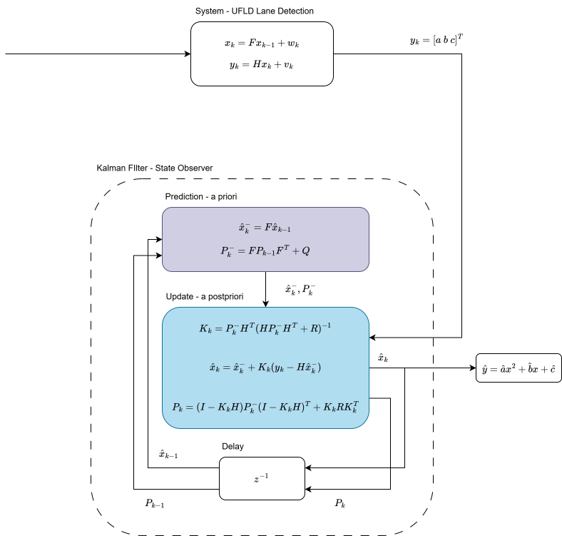
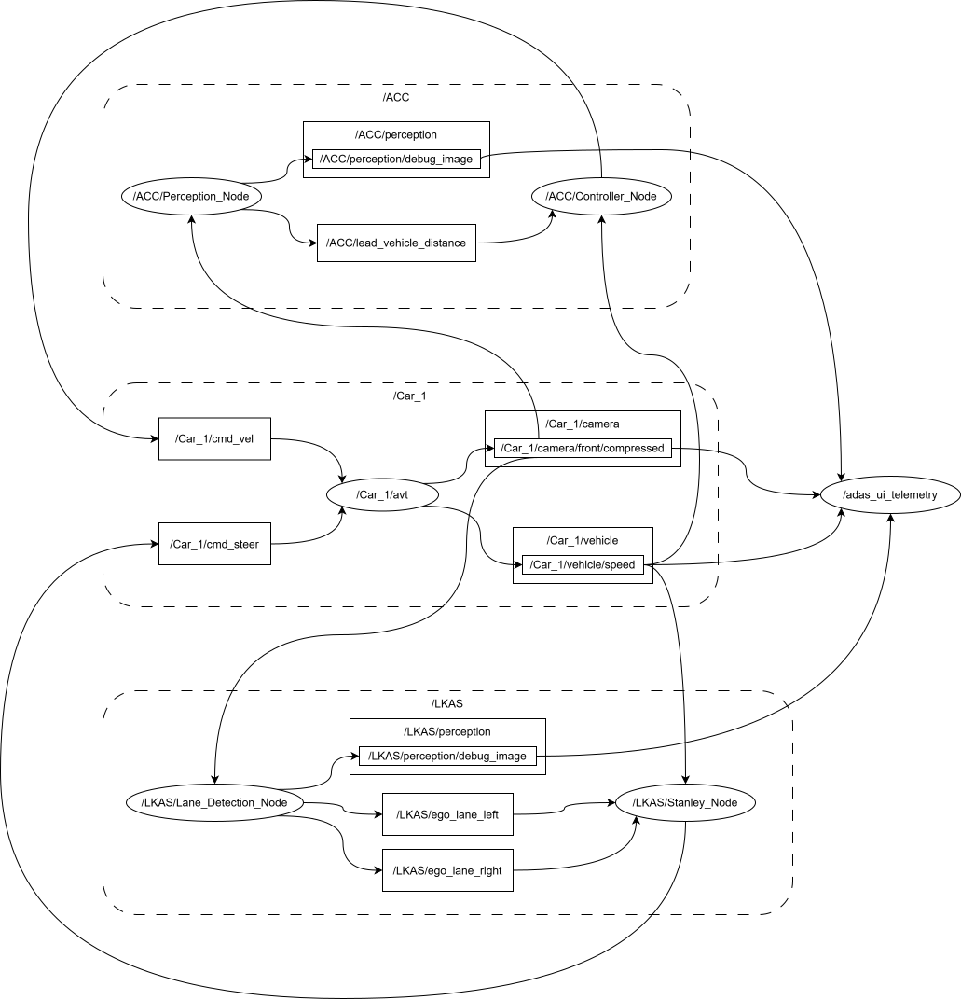

# ROS 2 ADAS Stack — ACC + LKAS

A ROS 2 Humble implementation of a two-function ADAS running against
CARLA 0.9.16 (primary) and MORAI (secondary). The stack combines
**Adaptive Cruise Control (ACC)** for longitudinal control and
**Lane-Keeping Assist (LKAS)** for lateral control on the same ego
vehicle, forming a **SAE Level 2** driver assistance system: the
driver remains responsible for supervision at all times, but throttle,
brake and steering are all automated within the declared operational
envelope.

Per UN Regulation No. 171 (Driver Control Assistance Systems), the two
features implemented are:

- **Positioning in the lane of travel** (R171 §5.3.7.1) — LKAS
- **Headway assistance** (R171 §5.3.7.5) — ACC

The declared System/Feature Designed Speed Range is **0–20 km/h**.
The system is validated on CARLA's built-in weather presets covering
**clear, cloudy, foggy and rainy conditions during daylight**; night,
snow and ice are outside the declared ODD. Roadway domain is R171
**Non-Highway** (urban and suburban with signalised and unsignalised
intersections, painted lane markings or kerbs required). Full ODD
declaration is in the thesis chapter of the same name.

## Demo

## Prerequisites

- **OS.** Ubuntu 22.04.5 LTS.
- **Simulator.** CARLA 0.9.16 (headless or windowed).
- **Middleware.** ROS 2 Humble Hawksbill.
- **GPU.** CUDA-capable for UFLD-V2 inference (tested on CUDA 11.8+).
- **Python.** System Python 3.10 with:

      python3 -m pip install ultralytics opencv-python "numpy<2"

- **External bridge.** `carlaAccSimTown.py` from the `carlaaccsim` repo
  (spawns the ego, publishes camera + speed, subscribes to the ACC/LKAS
  command topics).
- **Perception weights.** In `src/perception/models/`:
    - `best.pt` — YOLOv8 vehicle detector (ACC).
    - `UFLD_F1=0.87.pth` — UFLD-V2 ResNet-34 lane detector (LKAS).
- **UFLD source.** Ultra-Fast-Lane-Detection-V2 repository checked out
  at
  `/home/<user>/workspace/01_CV_Models/01_Ultra_Fast_Lane_Detection_V2/Ultra-Fast-Lane-Detection-V2`
  (path is a launch-time parameter).

### Build

    cd ~/workspace/03_ADAS_WK/ROS_ADAS_Stack
    colcon build --packages-select perception controller
    source install/setup.bash

### Run

    ./start_adas.sh carla

Ctrl-C shuts everything down cleanly. The launcher accepts `morai`
too, but LKAS is CARLA-tuned; the MORAI path is a work in progress
(see `DEBUG.md` chapters 24–32).

The recommended way to drive the stack is through the Tk UI
(`python3 UI.py`) — it launches CARLA, the bridge, and the ADAS stack
in the right order with the right parameters and exposes the runtime
knobs described below.

## ACC — Adaptive Cruise Control

**perception_node.py** runs YOLOv8 on the front camera at ~20 Hz, keeps
detections of the classes `{car, truck, bus, motorcycle}` with
`conf ≥ 0.80`, ground-projects their bounding boxes onto the road plane
via the same IPM the LKAS lane detector uses, and filters detections
whose ground-projected bounding box lies **inside the KF-smoothed ego
lane polygon** (a dynamic ROI that follows the road through curves,
with the historical static trapezoid as a warm-up fallback).

**controller_node.py** runs three control modes on top of that
distance-to-lead signal:

| Mode | Condition | Behaviour |
|---|---|---|
| **GATE** | YOLO and/or UFLD not yet loaded | Throttle and brake held at 0 |
| **CRUISE** | No lead vehicle detected | Proportional speed control toward target speed |
| **ACC** | Lead vehicle in range | PD distance controller with time-headway gap |
| **EMERGENCY** | Lead vehicle distance < 3 m | Immediate full brake |

The gate is data-driven — `TRANSIENT_LOCAL` `Bool` publishers on
`/ACC/perception/model_ready` and `/LKAS/perception/model_ready`, each
republished at 1 Hz as a heartbeat so late-joining or UI-restarted
perception processes still unlock the throttle (see DEBUG.md §33e).

### ACC control laws

**CRUISE mode** — symmetric proportional law with a 0.5 m/s deadband:

    e_v      = v_target − v_ego
    throttle = min(k_cruise · e_v, cap)    if e_v > +0.5 m/s
    brake    = min(k_cruise · |e_v|, 0.6)   if e_v < −0.5 m/s
    else     throttle = brake = 0

**ACC mode** — desired following distance and PD control on the gap:

    d_desired = d0 + T_gap · v_ego
    a         = k_p · (d_lead − d_desired) + k_d · d(closing_rate)/dt

### ACC tuned values

| Symbol | Meaning | Value |
|---|---|---|
| `CRUISE_SPEED_KMH` | Setpoint (offset above declared 20 km/h to compensate for P-controller steady-state error, see DEBUG.md §33d) | **25 km/h** |
| `d0` | Standstill gap | 5.0 m |
| `T_gap` | Time headway | 1.5 s |
| `k_p` | Distance gain | 1.2 |
| `k_d` | Closing-rate gain | 0.8 |
| `emergency_distance` | EMERGENCY-brake threshold | 3.0 m |
| `MIN_CONFIDENCE` | YOLO detection confidence gate | 0.80 |
| `MIN_PUBLISHED_GAP_M` | Lower clamp on published gap (IPM saturation) | 0.1 m |

Runtime override: publish `Float32` in km/h on `/ACC/target_speed` to
change the cruise target on the fly.

## LKAS — Lane-Keeping Assist

**lane_detection_node.py** runs UFLD-V2 inference on the same camera
feed (at 5 Hz — every 4th camera frame, see DEBUG.md §33a), extracts
per-row anchor points for the ego-left and ego-right lanes, projects
them into the vehicle frame via IPM, fits a quadratic
`y(x) = a x² + b x + c` per side, and feeds each frame's coefficients
into a **6-state Kalman filter** that smooths `(a, b, c)` in
coefficient space (see the KF section below).

**stanley_node.py** consumes the KF's centreline coefficients directly
from a side-channel topic `/LKAS/ego_lane_coeffs` when Kalman is
active. When that channel is stale (Kalman OFF or filter uninitialised)
it falls back to the classical Path-based Stanley that samples the
polylines at a fixed lookahead.

### Stanley control law — canonical + curvature feed-forward

Per Hoffmann-Tomlin-Montemerlo-Thrun ACC 2007 and Snider
CMU-RI-TR-09-08 §3.2 (2009), the Stanley formulation with a curvature
feed-forward term is:

    ψ      = arctan(b̂)                            heading error at ego
    e_ct   = ĉ                                     cross-track at ego
    κ      = 2·â / (1 + b̂²)^(3/2)                 road curvature at ego
    δ      = ψ + arctan(k · e_ct / (v + v_ε)) + arctan(κ · L)

Term 1 zeros heading error. Term 2 is the classic Stanley cross-track
law — proven asymptotically stable for fixed scalar gain `k`
(Hoffmann 2007). Term 3 is a curvature feed-forward that anticipates
the turn using the vehicle wheelbase `L`. All computed in the vehicle
Y-LEFT (REP 103) frame; the final δ is negated for CARLA's
positive-right steering convention.

### LKAS tuned values

| Symbol | Meaning | Value |
|---|---|---|
| `STANLEY_K` | Cross-track feedback gain | 0.5 |
| `STANLEY_HEADING_GAIN` | Heading-error gain | 1.0 |
| `STANLEY_EPS` | Speed regulariser `v_ε` | 0.5 m/s |
| `MAX_STEER_RAD` | Steering scale for normalisation | 70° |
| `LOOKAHEAD_M` | Path-mode Stanley lookahead | 5.0 m |
| `WHEELBASE_M` | CARLA `vehicle.dodge.charger_2020` wheelbase (`L`) | 3.048 m |
| `KF_COEFF_STALE_S` | Freshness window for KF-STAN mode | 0.3 s |

## UFLD-V2 — trained lane detector

- **Architecture.** Ultra-Fast-Lane-Detection-V2 with ResNet-34
  backbone (`configs/culane_res34.py`).
- **Weights.** `src/perception/models/UFLD_F1=0.87.pth`. This is a
  custom retrain of the CULane checkpoint on ~60 000 CARLA frames
  collected from `carlaaccsim`'s dataset collector, evaluated at
  F1 = 0.87 on a held-out CARLA validation set. See
  `02_UFLD_V2/DEBUG.md` §3.3 for the training recipe.
- **Runtime.** 288 × 800 input resolution; row+column hybrid anchors;
  ~20–30 ms per forward pass on CUDA. Inference is throttled to
  every 4th camera frame (5 Hz) to leave CPU headroom for the rest of
  the stack.
- **Confidence.** Per-lane soft confidence
  `exist_prob × pos_peak_prob` (mean across valid rows) is used by
  the KF's acceptance gate.

## Kalman filter — coefficient-space smoothing

A discrete-time Kalman filter smooths the UFLD polynomial coefficients
`(a, b, c)` before they reach the Stanley controller. The state is
6-dimensional — the three coefficients and their first time
derivatives — with a nearly-constant-velocity motion model per
coefficient and a continuous-white-noise-acceleration process noise
block (Bar-Shalom 2001).

Per-frame, R is populated directly from the `np.polyfit(cov=True)`
coefficient covariance — so noisy fits (near-degenerate rows, clipped
detections) automatically get down-weighted without a heuristic.
Innovations are validated against a χ²(3, 0.95) = 7.815 gate; outliers
are rejected without updating the state. Covariance updates use the
Joseph form for symmetric-PD stability at the tuned q values.

### KF tuned values

| Symbol | Meaning | Value |
|---|---|---|
| `q_a`, `q_b`, `q_c` | CWNA process-noise PSDs (curvature, heading, offset) | 0.5, 5.0, 5.0 |
| `KF_CONF_THRESHOLD` | Minimum UFLD per-lane confidence to enter update | 0.15 |
| `KF_MAX_COAST_TICKS` | Coast ticks before RST (≈ 4 s at 5 Hz) | 20 |
| `γ` | χ²(3, 0.95) validation gate | 7.815 |
| `KF_LOG_EVERY` | Steady-state log heartbeat cadence | 40 frames |

## ROS graph

The stack consists of five nodes across two packages, plus the CARLA
bridge and two debug/BEV visualisation nodes.

### Command topics (bridge boundary)

    /Car_1/camera/front/compressed     sensor_msgs/CompressedImage    ← camera in
    /Car_1/vehicle/speed               std_msgs/Float64                ← speed in (CARLA)
                                        example_interfaces/Float64      ← speed in (MORAI)
    /Car_1/cmd_vel                     geometry_msgs/Twist             → throttle (linear.x)
                                                                          + brake (linear.y)
    /Car_1/cmd_steer                   std_msgs/Float32                → normalised steer ∈ [−1, 1]
    /Car_1/in_junction                 std_msgs/Bool                   ← junction-zone flag

### ACC internal topics

    /ACC/lead_vehicle_distance         std_msgs/Float32                ← lead distance [m]
    /ACC/target_speed                  std_msgs/Float32                ← target [km/h] slider
    /ACC/perception/model_ready        std_msgs/Bool                    ← latched + 1 Hz heartbeat

### LKAS internal topics

    /LKAS/ego_lane_left                nav_msgs/Path                    ← left polyline, vehicle frame
    /LKAS/ego_lane_right               nav_msgs/Path                    ← right polyline, vehicle frame
    /LKAS/ego_lane_coeffs              std_msgs/Float32MultiArray       ← KF-smoothed [â, b̂, ĉ], KF-only side channel
    /LKAS/perception/model_ready       std_msgs/Bool                    ← latched + 1 Hz heartbeat

### Debug + telemetry topics

    /ACC/perception/debug_image        sensor_msgs/CompressedImage      ← YOLO overlay
    /LKAS/perception/debug_image       sensor_msgs/CompressedImage      ← raw UFLD dots
    /LKAS/perception/debug_image_kf    sensor_msgs/CompressedImage      ← KF cyan lines + red centreline
    /ADAS/perception/debug_image       sensor_msgs/CompressedImage      ← YOLO + UFLD fused (raw)
    /ADAS/perception/debug_image_kf    sensor_msgs/CompressedImage      ← YOLO + KF fused
    /ADAS/ipm/debug_image              sensor_msgs/CompressedImage      ← BEV overlay
    /ADAS/telemetry/speed_mps          std_msgs/Float32                 ← Stanley speed rebroadcast for UI

## UI — orchestration and telemetry

The Tk-based UI (`UI.py`) is the recommended entry point for driving
the stack — it handles the launch order and parameter passing that
otherwise has to be done by hand.

_TODO: insert `docs/ui_morai.png` (screenshot of UI driving MORAI)._

### What the UI does

- **Simulator processes.** Start/Stop CARLA (with quality preset and
  map selection); Start/Stop Bridge (`carlaAccSimTown.py`); Run
  `start_adas.sh`; Stop ADAS Stack; Start/Stop Foxglove; and, for
  MORAI, Start/Stop MORAI Bridge.
- **World controls.** Weather preset dropdown + Apply, Traffic count
  spinner + Spawn/Clear, RPC-port and Town selectors.
- **Ego spawn.** Spawn index selector (with a "List" button that
  enumerates the valid spawn indices on the current map).
- **Junction policy.** Dropdown for `pure-pursuit` vs `hold-straight`
  fallback while inside a junction.
- **ACC + LKAS toggles.** ACC ON/OFF (spawns YOLO + controller);
  LKAS ON/OFF (spawns UFLD + Stanley). Both show live "active" /
  "partial" indicators driven by the model-ready heartbeats.
- **KF tuning knobs.** `q_a`, `q_b`, `q_c` entry boxes + **Apply KF**
  button that pushes the values live via `ros2 param set` — no
  restart needed, backed by perception_node's
  `add_on_set_parameters_callback`.
- **Camera + BEV view.** Selectable source among Raw, ACC (YOLO),
  LKAS (UFLD), ADAS (YOLO+UFLD), ADAS (YOLO+KF), rendered next to the
  always-on BEV panel. Uses `qos_profile_sensor_data` on all image
  subscriptions so switching sources shows the newest frame, not the
  head of a stale queue (see DEBUG.md §33b).
- **Speed telemetry.** Speed reading in km/h at the top of the camera
  panel, fed by Stanley's rebroadcast on `/ADAS/telemetry/speed_mps`
  so it's immune to the CARLA-vs-MORAI Float64 message-type mismatch
  (see DEBUG.md §33g).
- **Rosbag recording.** Optional `--record` toggle passed through to
  the bridge.

## Runtime overrides

- `-p simulator:=<carla|morai>` on all ROS 2 nodes — picks the right
  speed-message type, camera extrinsics, Stanley gains, and cruise
  target.
- `-p model_filename:=<file>` on `perception_node` /
  `lane_detection_node` — resolves relative to
  `share/perception/models/` if not absolute.
- `-p enable_kalman:=<true|false>` on `lane_detection_node` — turns
  the KF and the coeff channel off, forcing Stanley into its
  path-based fallback for A/B comparison.
- `-p kf_q_a:=`, `-p kf_q_b:=`, `-p kf_q_c:=` — live-tunable KF PSDs
  via the perception node's `SetParametersCallback`.
- `-p inference_skip_n:=<n>` on `lane_detection_node` — every Nth
  camera frame gets an UFLD pass. Default 4 (5 Hz).

## Further reading

- **DEBUG.md** — chronological log of every non-obvious bug and
  design decision, including this session's CARLA hardening work in
  §33.
- **`02_UFLD_V2/DEBUG.md`** — UFLD training recipe and F1 evolution.
- **Thesis** — ODD declaration (R171-structured), KF derivation with
  citations, Stanley formulation, sensitivity study.
